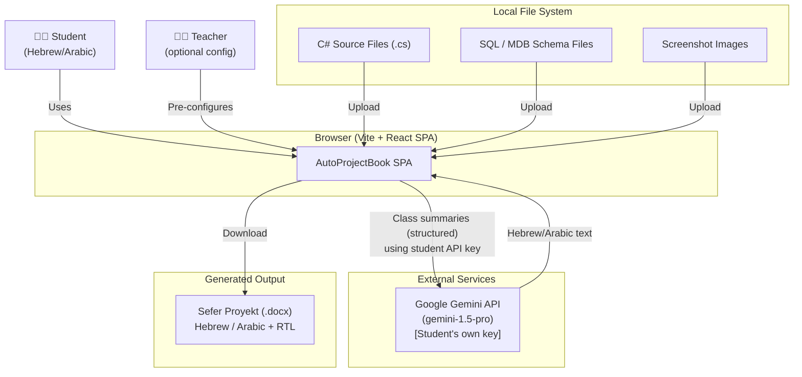

# AutoProjectBook — Technical Architecture Document

> **Version:** 1.0 | **Date:** 2026-03-29 | **Status:** Approved for Story Breakdown  
> **Architect:** Agbaria (AI-assisted via BMAD)

---

## Table of Contents

1. [Architecture Overview](#1-architecture-overview)
2. [System Context Diagram](#2-system-context-diagram)
3. [Frontend Application Architecture](#3-frontend-application-architecture)
4. [Component Structure](#4-component-structure)
5. [State Management Architecture](#5-state-management-architecture)
6. [Data Processing Pipeline](#6-data-processing-pipeline)
7. [AI Integration Architecture](#7-ai-integration-architecture)
8. [Document Generation Architecture](#8-document-generation-architecture)
9. [Diagram Generation Architecture](#9-diagram-generation-architecture)
10. [Security Architecture](#10-security-architecture)
11. [Folder Structure](#11-folder-structure)
12. [Key Design Decisions](#12-key-design-decisions)
13. [Dependency Graph](#13-dependency-graph)

---

## 1. Architecture Overview

AutoProjectBook is a **purely client-side Single Page Application (SPA)**. There is no backend server, no database, and no authentication service. All compute happens within the user's browser.

```
┌─────────────────────────────────────────────────────┐
│                   USER'S BROWSER                    │
│                                                     │
│  ┌─────────────────────────────────────────────┐   │
│  │     AutoProjectBook SPA (React + Vite)      │   │
│  │                                             │   │
│  │  ┌──────────┐  ┌──────────┐  ┌──────────┐ │   │
│  │  │  Wizard  │  │  Review  │  │  Export  │ │   │
│  │  │   Flow   │  │  Editor  │  │  Engine  │ │   │
│  │  └──────────┘  └──────────┘  └──────────┘ │   │
│  │                                             │   │
│  │  ┌────────────────────────────────────┐    │   │
│  │  │         Processing Services        │    │   │
│  │  │  C# Parser │ SQL Parser │DB Parser  │    │   │
│  │  └────────────────────────────────────┘    │   │
│  │                                             │   │
│  │  ┌────────────────────────────────────┐    │   │
│  │  │      Zustand State Store           │    │   │
│  │  └────────────────────────────────────┘    │   │
│  └─────────────────────────────────────────┘   │
│           │                    │                │
│    ┌──────▼──────┐    ┌────────▼───────┐       │
│    │ File System  │    │  Gemini API    │       │
│    │ (local files)│    │  (student key) │       │
│    └─────────────┘    └────────────────┘       │
└─────────────────────────────────────────────────────┘
```

**Key Architectural Properties:**
- **Zero-server**: No API gateway, no backend, no ops cost
- **Privacy-by-design**: Student code never leaves the browser except named Gemini calls
- **Progressive enhancement**: Partial data → partial document always works
- **Feature isolation**: Each chapter's generation is an independent module

---

## 2. System Context Diagram



---

## 3. Frontend Application Architecture

### 3.1 Technology Stack

| Concern | Solution | Rationale |
|---------|----------|-----------|
| UI Framework | React 18 + TypeScript | Mature, wide ecosystem, concurrent rendering |
| Build Tool | Vite 5 | Fast HMR, native ESM, minimal config |
| Styling | Tailwind CSS v3 | Utility-first, RTL logical properties built-in |
| State | Zustand v4 | Simple, TypeScript-native, no boilerplate |
| Routing | React Router v6 | SPA routing, nested routes for wizard steps |
| Doc Generation | `docx` (docx.js) v8 | Browser-side DOCX; full Word XML control |
| Diagram Library | Mermaid.js v10 | Text-to-diagram; supports RTL labels |
| Rich Text Editor | `slate-js` or `lexical` | Lightweight RTL-capable editor for review step |
| HTTP Client | Native `fetch` | No external lib needed; single API endpoint |
| Testing | Vitest + React Testing Library | Vite-native; fast unit tests |

### 3.2 Application Shell

```
src/
├── App.tsx               # Root — Router + providers
├── main.tsx              # Vite entry + React root
├── i18n/
│   ├── index.ts          # i18n config (react-i18next or custom)
│   ├── he.json           # Hebrew strings
│   └── ar.json           # Arabic strings
├── store/
│   ├── index.ts          # Zustand store assembly
│   ├── types.ts          # All TypeScript types
│   └── slices/           # Per-feature slices
│       ├── onboarding.ts
│       ├── extraction.ts
│       ├── generation.ts
│       └── export.ts
├── routes/               # React Router pages
├── features/             # Feature modules (see §4)
├── services/             # Pure logic, no UI
├── components/           # Shared UI primitives
└── assets/               # Static assets
```

### 3.3 Routing Structure

```
/                           → Welcome / Language Selection
/onboarding/school          → School metadata form
/onboarding/project         → Project type selection
/onboarding/api-key         → Gemini API key entry
/extract/database           → DB schema upload & review
/extract/code               → C# code upload & class review
/extract/screenshots        → Screenshot gallery
/generate                   → AI generation progress
/review/:chapterKey         → Per-chapter review editor
/review/diagrams            → Diagram preview & edit
/preview                    → Full document preview
/export                     → Generate & download
```

---

## 4. Component Structure

### 4.1 Feature Module Pattern

Each feature is a self-contained folder:

```
src/features/
├── onboarding/
│   ├── components/
│   │   ├── LanguageSelector.tsx
│   │   ├── SchoolMetadataForm.tsx
│   │   ├── ProjectTypeSelector.tsx
│   │   └── ApiKeyInput.tsx
│   ├── hooks/
│   │   └── useOnboarding.ts
│   └── index.ts
│
├── extraction/
│   ├── components/
│   │   ├── DatabaseUploader.tsx
│   │   ├── SchemaReviewTable.tsx
│   │   ├── CodeUploader.tsx
│   │   ├── ClassExplorer.tsx
│   │   ├── ScreenshotGallery.tsx
│   │   └── ScreenshotCard.tsx
│   ├── hooks/
│   │   ├── useDatabaseExtraction.ts
│   │   └── useCodeExtraction.ts
│   └── index.ts
│
├── generation/
│   ├── components/
│   │   ├── GenerationProgress.tsx
│   │   └── ChapterStatus.tsx
│   ├── hooks/
│   │   └── useGeneration.ts
│   └── index.ts
│
├── review/
│   ├── components/
│   │   ├── ChapterEditor.tsx
│   │   ├── DiagramEditor.tsx
│   │   └── ReviewSidebar.tsx
│   ├── hooks/
│   │   └── useReview.ts
│   └── index.ts
│
└── export/
    ├── components/
    │   ├── DocumentPreview.tsx
    │   └── ExportButton.tsx
    ├── hooks/
    │   └── useExport.ts
    └── index.ts
```

### 4.2 Shared Components

```
src/components/
├── layout/
│   ├── WizardLayout.tsx        # Step wrapper with progress indicator
│   ├── StepIndicator.tsx       # Visual step tracker
│   └── RTLProvider.tsx         # dir + lang context provider
├── ui/
│   ├── Button.tsx
│   ├── Input.tsx
│   ├── Select.tsx
│   ├── FileUploader.tsx        # Drag-and-drop file upload
│   ├── ProgressBar.tsx
│   ├── Toast.tsx
│   ├── Skeleton.tsx
│   └── ErrorBoundary.tsx
└── typography/
    ├── Heading.tsx             # RTL-aware headings
    └── BodyText.tsx            # RTL body text
```

---

## 5. State Management Architecture

### 5.1 Zustand Store Design

```typescript
// src/store/index.ts — assembled from slices

import { create } from 'zustand';
import { persist, createJSONStorage } from 'zustand/middleware';

// Core store: persisted to sessionStorage
export const useAppStore = create(
  persist(
    (set, get) => ({
      ...createOnboardingSlice(set, get),
      ...createExtractionSlice(set, get),
      ...createGenerationSlice(set, get),
      ...createExportSlice(set, get),
    }),
    {
      name: 'apb-session',
      storage: createJSONStorage(() => sessionStorage),
      // Exclude sensitive data from persistence
      partialize: (state) => ({
        ...state,
        geminiApiKey: undefined,  // Never persist API key
        // Exclude File objects (not serializable)
        screenshots: state.screenshots.map(s => ({ ...s, file: undefined })),
      }),
    }
  )
);
```

### 5.2 Slice Architecture

```
onboarding slice:
  { language, geminiApiKey (session only), schoolMetadata, projectType }

extraction slice:
  { dbSchema, classes, screenshots, extractionErrors }

generation slice:
  { generatedContent, diagrams, generationStatus, generationQueue }

export slice:
  { previewHtml, exportStatus, lastExportDate }
```

### 5.3 State Flow

```
User Action
    │
    ▼
React Component (UI)
    │
    ├─ Calls → Service function (pure logic)
    │               │
    │               └─ Returns data
    │
    ├─ Dispatches → Zustand store.set()
    │
    └─ UI re-renders from store subscription
```

---

## 6. Data Processing Pipeline

### 6.1 T-SQL Parser Pipeline

```
Input: .sql file (string)
    │
    ├─ 1. Tokenizer: strip comments, normalize whitespace
    │
    ├─ 2. Statement splitter: split on GO / semicolons
    │
    ├─ 3. CREATE TABLE extractor:
    │      - RegEx: /CREATE\s+TABLE\s+(\[?\w+\]?)\.?(\[?\w+\]?)/gi
    │      - Extract column definitions
    │      - Extract PRIMARY KEY constraints
    │      - Extract FOREIGN KEY constraints
    │
    ├─ 4. Relationship builder:
    │      - Map FK references to table graph
    │      - Detect junction tables (table with 2+ FKs, no other PKs)
    │
    └─ Output: DatabaseSchema (TypeScript)
```

**Parser module:** `src/services/parsers/sqlParser.ts`

### 6.2 MS Access Parser Pipeline

```
Input: .mdb / .accdb file (ArrayBuffer)
    │
    ├─ 1. WASM library initialization (mdb-parser or jackmdb)
    │
    ├─ 2. Table enumeration
    │
    ├─ 3. System tables filter (exclude MSys* tables)
    │
    ├─ 4. Column metadata extraction per table
    │
    └─ Output: DatabaseSchema (same interface as SQL parser)

Fallback: if WASM unavailable → ManualEntryMode
```

**Parser module:** `src/services/parsers/accessParser.ts`

### 6.3 C# Parser Pipeline

```
Input: Array of .cs file strings
    │
    ├─ 1. Pre-processor: strip comments, resolve #region blocks
    │
    ├─ 2. Per-file tokenizer:
    │      - Identify namespace declarations
    │      - Identify class/interface/enum blocks
    │      - Extract class-level attributes
    │
    ├─ 3. Class member extractor:
    │      - Properties (including auto-properties)
    │      - Methods (signature only — no bodies)
    │      - Fields
    │      - Constructors
    │      - Inheritance/interface implementations
    │      - XML doc comments (///)
    │
    ├─ 4. Relationship mapper:
    │      - Build inheritance tree
    │      - Identify composition (property type = another extracted class)
    │
    └─ Output: CSharpClass[] (TypeScript)
```

**Parser module:** `src/services/parsers/csharpParser.ts`

### 6.4 Screenshot Processing Pipeline

```
Input: File[] from file picker
    │
    ├─ 1. MIME type validation (image/png, image/jpeg, image/webp)
    │
    ├─ 2. Size validation (≤ 5 MB per file)
    │
    ├─ 3. Thumbnail generation:
    │      - Create <canvas> element
    │      - Draw image scaled to 300×200
    │      - Export as data URI
    │
    └─ Output: Screenshot[] with thumbnailUrl (data URI) and File reference
```

---

## 7. AI Integration Architecture

### 7.1 Gemini Service Interface

```typescript
// src/services/gemini.ts

interface GeminiService {
  generateIntroduction(context: IntroContext): Promise<string>;
  generateSystemAnalysis(context: SystemContext): Promise<string>;
  generateDatabaseSection(tables: DatabaseTable[]): Promise<string>;
  generateClassDescription(cls: CSharpClass): Promise<string>;
  generateSecuritySection(context: ImplContext): Promise<string>;
  generateAIUsageDoc(context: ProjectContext): Promise<string>;
  generateReflectionScaffold(context: ReflectionContext): Promise<string>;
  testApiKey(): Promise<boolean>;
}
```

### 7.2 API Call Architecture

```
GenerationQueue (Zustand slice)
    │
    ├─ Each chapter = one task in queue
    │
    ├─ Concurrency limit: 2 parallel Gemini calls
    │   (to respect rate limits)
    │
    ├─ Each call:
    │   - Build system prompt (language + tone)
    │   - Build user prompt (structured context)
    │   - POST to Gemini REST endpoint
    │   - Stream response → update store.generatedContent
    │
    └─ On error:
        - Retry once with exponential backoff
        - If still fails: insert placeholder text + mark section as 'failed'
```

### 7.3 Prompt Strategy

All prompts follow this structure:

```
SYSTEM:
  "You are a professional technical writer helping Israeli high-school students
   write their mandatory Software Engineering project book (Sefer Proyekt) in
   formal {language}. Write academically using present tense. Do not use English
   words unless they are technical terms. Format output as plain paragraphs,
   no markdown."

USER:
  "[Chapter-specific context in structured form]
   
   Based on this, write the [chapter/section] as it would appear in the
   project book. Length: approximately [N] words. Level: high-school senior."
```

### 7.4 Data Sent to Gemini

| Chapter | What is Sent | What is NOT Sent |
|---------|-------------|-----------------|
| Introduction | Project name, type, table names, class names | Source code |
| Database | Table/column names + types | Actual data records |
| Class description | Class name, method signatures, property list, XML docs | Method bodies |
| AI Usage | Tool names, usage descriptions | API keys |
| Security section | Field names, existence of FK constraints | Connection strings |

**Principle:** Never send method bodies, connection strings, passwords, or actual data.

---

## 8. Document Generation Architecture

### 8.1 docx.js Builder Pattern

```
src/services/docBuilder/
├── index.ts              # Orchestrator: assembles all chapters
├── styles.ts             # Shared Word styles (fonts, RTL, spacing)
├── chapters/
│   ├── coverPage.ts      # Chapter builder: cover page
│   ├── toc.ts            # Auto-TOC field
│   ├── introduction.ts   # Chapter 1 builder
│   ├── systemAnalysis.ts # Chapter 2 builder
│   ├── database.ts       # Chapter 3 builder
│   ├── serverImpl.ts     # Chapter 4 builder
│   ├── clientImpl.ts     # Chapter 5 builder
│   ├── userGuide.ts      # Chapter 6 builder
│   ├── reflection.ts     # Chapter 7 builder
│   └── appendices.ts     # Chapter 8 builder
└── utils/
    ├── imageEmbed.ts     # Embed PNG dataURLs in docx
    ├── tableBuilder.ts   # Reusable docx table factory
    └── rtlText.ts        # RTL paragraph + bidi helpers
```

### 8.2 RTL Document Configuration

```typescript
// src/services/docBuilder/styles.ts

const RTL_PARAGRAPH_STYLE = {
  bidirectional: true,
  alignment: AlignmentType.RIGHT,
  spacing: { line: 360 },  // 1.5 line spacing
};

const HEBREW_RUN_STYLE = {
  font: { name: 'David MT', size: 24 },  // Size in half-points (24 = 12pt)
};

const CODE_RUN_STYLE = {
  font: { name: 'Courier New', size: 20 },  // 10pt
  rtl: false,  // Code blocks are always LTR
};

const HEADING1_STYLE = {
  ...RTL_PARAGRAPH_STYLE,
  bold: true,
  size: 28,  // 14pt
  alignment: AlignmentType.CENTER,
};
```

### 8.3 Image Embedding Architecture

```
Screenshot/Diagram Image Embed Pipeline:

1. Input: PNG data URL (from Mermaid render or screenshot)
    │
2. Convert data URL to Uint8Array buffer
    │
3. Pass to docx ImageRun with dimensions calculated
    to fit within A4 width (15.5cm usable width)
    │
4. Center as block element within paragraph
    │
5. Add figure caption below (RTL paragraph)
```

### 8.4 Chapter Orchestration

```typescript
// src/services/docBuilder/index.ts

export async function buildDocument(state: AppState): Promise<Blob> {
  const chapters: (Paragraph | Table | ImageRun)[] = [];
  
  chapters.push(...buildCoverPage(state.schoolMetadata));
  chapters.push(...buildTOC());
  chapters.push(...buildIntroduction(state.generatedContent.introduction));
  chapters.push(...buildSystemAnalysis(
    state.generatedContent.systemAnalysis,
    state.diagrams
  ));
  chapters.push(...buildDatabase(
    state.generatedContent.database,
    state.dbSchema,
    state.diagrams.erd
  ));
  chapters.push(...buildServerImplementation(
    state.generatedContent.serverImplementation,
    state.classes,
    state.diagrams.uml
  ));
  chapters.push(...buildClientImplementation(
    state.generatedContent.clientImplementation,
    state.screenshots.filter(s => s.userType !== 'admin')
  ));
  chapters.push(...buildUserGuide(
    state.generatedContent.userGuide,
    state.screenshots
  ));
  chapters.push(...buildReflection(state.generatedContent.reflection));
  chapters.push(...buildAppendices(state.classes));

  const doc = new Document({
    sections: [{
      properties: {
        page: { size: { width: 11906, height: 16838 } },  // A4 in twips
        pageNumberStart: 1,
      },
      children: chapters,
    }],
    styles: getDocumentStyles(state.language),
  });

  return Packer.toBlob(doc);
}
```

---

## 9. Diagram Generation Architecture

### 9.1 Mermaid Pipeline

```
Input: CSharpClass[] / DatabaseSchema
    │
    ├─ Generator function builds Mermaid text definition
    │   (pure TypeScript, no DOM access)
    │
    ├─ Store: state.diagrams[type].mermaidCode = definition
    │
    ├─ DiagramEditor component:
    │   - Renders <pre> with editable Mermaid code
    │   - Calls mermaid.render() on load + on code change
    │   - Renders SVG in preview panel
    │
    ├─ Export step:
    │   - mermaid.render() → SVG string
    │   - Convert SVG → PNG using Canvas API
    │     (draw SVG onto canvas, export as dataURL)
    │   - Store PNG dataURL in state.diagrams[type].pngDataUrl
    │
    └─ docBuilder embeds pngDataUrl as Word image
```

### 9.2 UML Generator

```typescript
// src/services/generators/umlGenerator.ts

export function generateUMLDiagram(classes: CSharpClass[]): string {
  const lines: string[] = ['classDiagram'];
  
  for (const cls of classes.filter(c => !c.isExcluded)) {
    // Class declaration
    lines.push(`  class ${cls.name} {`);
    
    // Properties (top N)
    cls.properties.slice(0, 8).forEach(p => {
      const modifier = p.accessModifier === 'public' ? '+' : '-';
      lines.push(`    ${modifier}${p.type} ${p.name}`);
    });
    
    // Key methods
    cls.methods.filter(m => m.accessModifier === 'public').slice(0, 5).forEach(m => {
      lines.push(`    +${m.name}()`);
    });
    
    lines.push(`  }`);
    
    // Inheritance
    if (cls.baseClass) {
      lines.push(`  ${cls.name} --|> ${cls.baseClass}`);
    }
    
    // Interface implementations
    cls.interfaces.forEach(iface => {
      lines.push(`  ${cls.name} ..|> ${iface}`);
    });
    
    // Composition (property type is another extracted class)
    const classNames = new Set(classes.map(c => c.name));
    cls.properties.forEach(p => {
      if (classNames.has(p.type)) {
        lines.push(`  ${cls.name} o-- ${p.type}`);
      }
    });
  }
  
  return lines.join('\n');
}
```

### 9.3 ERD Generator

```typescript
// src/services/generators/erdGenerator.ts

export function generateERDDiagram(schema: DatabaseSchema): string {
  const lines: string[] = ['erDiagram'];
  
  for (const table of schema.tables) {
    lines.push(`  ${sanitizeId(table.name)} {`);
    table.columns.forEach(col => {
      const pk = col.isPrimaryKey ? ' PK' : '';
      const fk = col.isForeignKey ? ' FK' : '';
      lines.push(`    ${col.type} ${sanitizeId(col.name)}${pk}${fk}`);
    });
    lines.push(`  }`);
  }
  
  // Relationships from FK definitions
  for (const table of schema.tables) {
    table.columns
      .filter(c => c.isForeignKey && c.referencesTable)
      .forEach(c => {
        lines.push(`  ${sanitizeId(table.name)} }o--|| ${sanitizeId(c.referencesTable!)} : ""`);
      });
  }
  
  return lines.join('\n');
}
```

---

## 10. Security Architecture

### 10.1 Content Security Policy

```
Content-Security-Policy:
  default-src 'self';
  script-src 'self' 'unsafe-eval';   # unsafe-eval needed by Mermaid
  style-src 'self' 'unsafe-inline';  # Tailwind JIT
  img-src 'self' data: blob:;        # data: for canvas exports
  connect-src 'self' https://generativelanguage.googleapis.com;
  font-src 'self' data:;
  worker-src 'self' blob:;           # Web Workers for parsers
```

### 10.2 API Key Handling

```
User enters API key
        │
        ├─ Store in Zustand (in-memory)
        │
        ├─ Optionally write to sessionStorage (cleared on tab close)
        │
        ├─ User explicitly opts in → write to localStorage
        │   with UI warning: "This key is stored locally on your device"
        │
        └─ On API call:
             - Read from Zustand store (memory)
             - Pass directly as Authorization header to Gemini
             - NEVER log, display, or transmit to any other endpoint
```

### 10.3 Input Sanitization

All user text inputs (school name, student name, etc.) are sanitized before docx embedding:

```typescript
// src/services/docBuilder/utils/sanitize.ts

export function sanitizeDocxText(input: string): string {
  return input
    .replace(/[\x00-\x08\x0B\x0C\x0E-\x1F\x7F]/g, '')  // Control chars
    .replace(/[<>&"']/g, (c) => ENTITY_MAP[c])            // HTML entities
    .trim()
    .slice(0, 500);  // Hard length limit
}
```

### 10.4 File Upload Security

```
Uploaded file validation:
  - MIME type check (not just extension)
  - File size limit enforced before reading
  - All file content processed in memory only
  - No file paths stored (only File objects with original name for display)
  - C# parser never executes uploaded code — text-only tokenization
```

---

## 11. Folder Structure

```
projectbook/
├── public/
│   ├── index.html
│   └── fonts/                # David MT, Arial Hebrew
├── src/
│   ├── main.tsx
│   ├── App.tsx
│   ├── routes/
│   │   ├── index.tsx          # Route definitions
│   │   └── guards/
│   │       └── StepGuard.tsx  # Redirect if previous step not complete
│   ├── features/
│   │   ├── onboarding/
│   │   ├── extraction/
│   │   ├── generation/
│   │   ├── review/
│   │   └── export/
│   ├── services/
│   │   ├── gemini.ts          # AI integration
│   │   ├── parsers/
│   │   │   ├── sqlParser.ts
│   │   │   ├── accessParser.ts
│   │   │   └── csharpParser.ts
│   │   ├── generators/
│   │   │   ├── umlGenerator.ts
│   │   │   ├── erdGenerator.ts
│   │   │   ├── dfdGenerator.ts
│   │   │   └── usecaseGenerator.ts
│   │   └── docBuilder/
│   │       ├── index.ts
│   │       ├── styles.ts
│   │       ├── chapters/
│   │       └── utils/
│   ├── store/
│   │   ├── index.ts
│   │   ├── types.ts
│   │   └── slices/
│   ├── components/
│   │   ├── layout/
│   │   ├── ui/
│   │   └── typography/
│   ├── i18n/
│   │   ├── index.ts
│   │   ├── he.json
│   │   └── ar.json
│   └── utils/
│       ├── mermaid.ts         # Mermaid render + SVG→PNG export
│       ├── fileUtils.ts
│       └── constants.ts
├── tests/
│   ├── unit/
│   │   ├── parsers/
│   │   └── generators/
│   └── integration/
├── index.html
├── vite.config.ts
├── tailwind.config.ts
├── tsconfig.json
└── package.json
```

---

## 12. Key Design Decisions

### ADR-01: No Backend
**Decision:** Browser-only SPA. No Node.js server.  
**Rationale:** Students cannot deploy a server. Zero ops cost. Privacy by architecture.  
**Trade-offs:** Limited to browser File API (no folder browsing on Firefox/Safari); Gemini key exposed to browser DevTools.  
**Mitigation:** Document browser limitation. Warn user about key in DevTools.

### ADR-02: docx.js over html-to-docx
**Decision:** Use `docx` library with programmatic API (not HTML-to-docx conversion).  
**Rationale:** Precise control over RTL bidi settings, paragraph direction, and font families. HTML-to-docx tools produce unreliable RTL output.  
**Trade-offs:** More code per chapter; no WYSIWYG preview ties to actual docx output.  
**Mitigation:** Style document preview HTML to closely mimic docx styles.

### ADR-03: Mermaid.js for All Diagrams
**Decision:** Use Mermaid.js for UML, ERD, DFD, and UseCase diagrams.  
**Rationale:** Text-based definitions are editable by students; renders in browser without external service; widely used in technical documentation.  
**Trade-offs:** Limited layout control; complex diagrams may render poorly.  
**Mitigation:** Cap class count in UML (20 classes max); provide manual edit of Mermaid code.

### ADR-04: Zustand over Redux
**Decision:** Zustand for state management.  
**Rationale:** Minimal boilerplate, TypeScript-first, works well with sessionStorage persist middleware. Redux adds too much complexity for a single-developer project.  
**Trade-offs:** Less DevTools support than Redux.

### ADR-05: Gemini API Streaming
**Decision:** Use Gemini streaming API for text generation.  
**Rationale:** Students see content appearing in real time, which reduces perceived wait time and allows them to spot errors early and cancel if needed.  
**Trade-offs:** Streaming requires more complex state management.

### ADR-06: SQL Parser via Regex/Custom Tokenizer
**Decision:** Build a lightweight custom T-SQL parser rather than using a full SQL parser library.  
**Rationale:** Full SQL parser libraries (e.g., `node-sql-parser`) are large (>500KB) and designed for Node.js. The only T-SQL we need to parse is `CREATE TABLE`, `PRIMARY KEY`, and `FOREIGN KEY` — a small, well-defined grammar.  
**Trade-offs:** May miss edge cases in non-standard T-SQL syntax.  
**Mitigation:** Manual correction UI for parsed schema always available.

### ADR-07: sessionStorage First, localStorage Opt-In
**Decision:** All session data in `sessionStorage` by default; `localStorage` only with explicit user consent.  
**Rationale:** Minimizes data persistence risk in shared-computer school environments.

---

## 13. Dependency Graph

```
App (React Router)
├── WizardLayout
│   └── StepIndicator
│
├── Feature: Onboarding
│   └── Services: (none — pure form state)
│
├── Feature: Extraction
│   └── Services:
│       ├── sqlParser (→ DatabaseSchema)
│       ├── accessParser (→ DatabaseSchema)
│       └── csharpParser (→ CSharpClass[])
│
├── Feature: Generation
│   └── Services:
│       ├── gemini (→ string per chapter)
│       ├── umlGenerator (DatabaseSchema → Mermaid text)
│       ├── erdGenerator (CSharpClass[] → Mermaid text)
│       ├── dfdGenerator (ProjectContext → Mermaid text)
│       └── usecaseGenerator (UserTypes → Mermaid text)
│
├── Feature: Review
│   └── Services:
│       └── mermaid render util (Mermaid text → SVG/PNG)
│
└── Feature: Export
    └── Services:
        └── docBuilder
            ├── coverPage
            ├── toc
            ├── introduction
            ├── systemAnalysis  ─── diagrams (PNG)
            ├── database        ─── DatabaseSchema + ERD PNG
            ├── serverImpl      ─── CSharpClass[] + UML PNG
            ├── clientImpl      ─── Screenshots
            ├── userGuide       ─── Screenshots
            ├── reflection
            └── appendices      ─── CSharpClass[] source
```

---

## 14. Epics Overview (Pre-Story Breakdown)

> These epics are the next breakdown level. Each will be broken into individual stories.

| Epic | Title | Key Deliverable |
|------|-------|-----------------|
| **E1** | Onboarding & Configuration | Working multi-step wizard with school metadata, language, project type, API key validation |
| **E2** | Database Extraction | T-SQL and MS Access parsers + schema review UI + manual entry fallback |
| **E3** | Code Extraction | C# file parser + class browser UI + key snippet selection |
| **E4** | Screenshot Gallery | Upload, caption, reorder, thumbnail gallery |
| **E5** | AI Content Generation | Gemini service + generation queue + streaming display for all 8 chapters |
| **E6** | Diagram Generation | UML, ERD, DFD, UseCase Mermaid generators + preview/edit UI + PNG export |
| **E7** | Content Review & Editing | Section-by-section editor, regeneration, progress tracker |
| **E8** | Document Export | docx.js builders for all 8 chapters + RTL/Hebrew formatting + download |
| **E9** | Compliance & QA | MoE checklist validation, cross-browser testing, accessibility audit |
